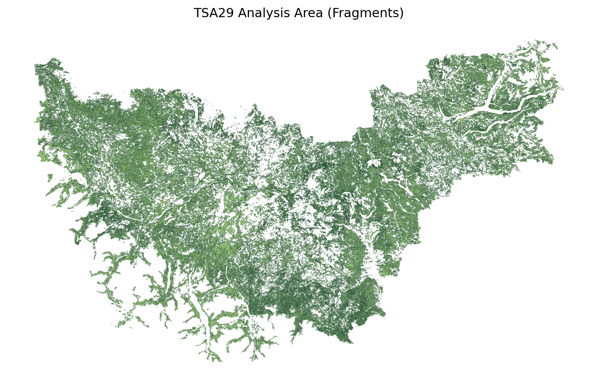

Land Base and Assumptions
=========================

Purpose
-------

This page captures the minimum land-base and model-assumption context needed to
interpret the published TSA29 snapshot responsibly.

Land Base Definition
--------------------

TSA29 area is represented by ``output/patchworks_tsa29_validated/fragments``.

For most readers, that fragments package is the operative spatial definition of
the published baseline. It is the starting point for Patchworks-facing
interpretation, area accounting, and downstream model package review.

Analysis Area Map
-----------------

   TSA29 analysis area from validated fragment geometry.

Assumption Notes
----------------

- TIPSY rules are defined in ``config/tipsy/tsa29.yaml``.
- Natural/planted curve assignments are controlled by IFM status in the
  fragment/model-track pipeline.

Operational Interpretation Notes
--------------------------------

- ``config/run_profile.tsa29.yaml`` is the authoritative runtime profile for
  this instance.
- ``data/model_input_bundle/*.csv`` is the most direct tabular surface for
  reviewing what the published baseline is feeding into planning-system export.
- ``output/patchworks_tsa29_validated/forestmodel.xml`` and the fragments
  package are the main exported model artifacts for reviewer inspection.

What This Page Does Not Claim
-----------------------------

This page is intentionally concise. It does **not** attempt to restate every
TSA29 policy or TSR assumption in prose. Instead, it points maintainers to the
files that currently own those assumptions:

- ``config/tipsy/tsa29.yaml``
- ``config/run_profile.tsa29.yaml``
- ``data/model_input_bundle/*.csv``
- ``output/patchworks_tsa29_validated/fragments/``
- ``evidence/curve_stability_report.20260315.md``

If those files change materially, this page should be updated alongside them.
